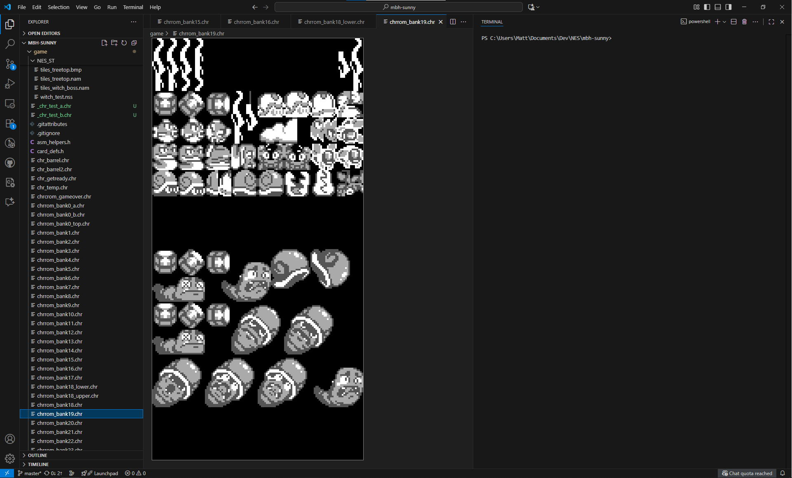
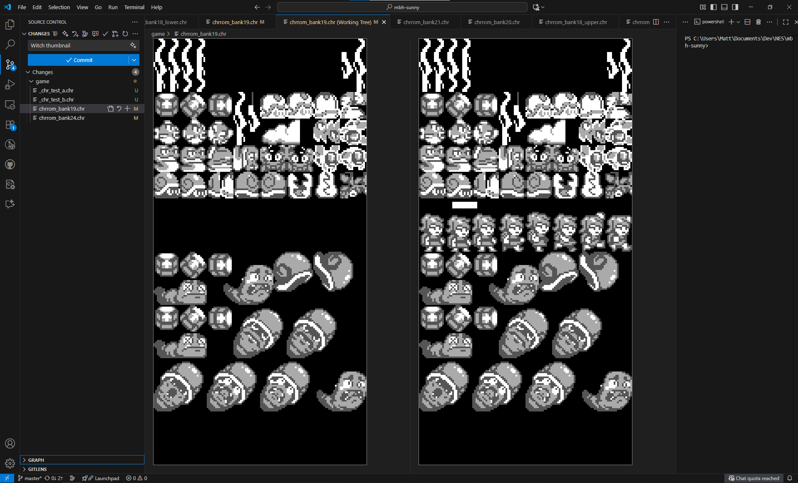

# NES CHR Diff Viewer for Visual Studio Code

NES CHR Diff Viewer is a Visual Studio Code extension that provides a visual preview and diffing experience for NES CHR ROM files (`*.chr`). It renders CHR data as a 4-color image and supports side-by-side "before/after" views when inspecting changes in source control.

## Features

- Visual preview for `*.chr` files rendered as NES tiles using a grayscale palette.
- Side-by-side diff view for CHR files in Source Control (shows before and after states).
- Live update: the viewer refreshes when the underlying file changes on disk.

## Installation

Install from the Visual Studio Code Marketplace (COMING SOON) or use the provided VSIX in this repository:

1. Download the latest installer from: https://github.com/mhughson/mbh-chrdiffextension/releases
2. Open the Extensions view in VS Code.
3. Install the shipped VSIX: `Extensions: Install from VSIX...` and select `nes-chr-diff-viewer-X.X.X.vsix`.

## Usage

- Open a `*.chr` file in the Explorer to see a visual preview of the CHR tile set.
- Open a CHR file from the Source Control diff view to see a side-by-side comparison of the file's previous and current contents.
- The viewer automatically reloads when the file is modified on disk.

## Screenshots

Viewer:



Diff view (before / after):



## Development

This extension is an early-stage project. To build and run locally:

```powershell
npm install
npm run compile
```

To run the extension in the Extension Development Host, press F5 in VS Code.

## Contributing

Contributions are welcome. Please open issues or PRs on the project's GitHub repository. Consider the following when contributing:

- Keep changes small and focused.
- Add tests for new functionality when practical.

## License

[View LICENSE](./LICENSE)
